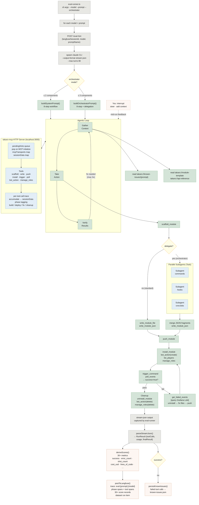

```mermaid
flowchart TD
    %% ─────────────── EVAL-RUNNER ───────────────
    CLI["eval-runner.ts\ncli args: --model --prompt --orchestrator"]

    CLI --> LOOP["for each model × prompt"]

    LOOP --> HINT["POST /eval-hint\n(langfuseSessionId, model, promptName)"]
    HINT --> SPAWN["spawn claude CLI\n--output-format stream-json\n--max-turns 80"]

    %% ─────────────── SYSTEM PROMPT BRANCH ───────────────
    SPAWN --> PROMPTBRANCH{orchestrator\nmode?}
    PROMPTBRANCH -- "≤ 2 components" --> STD["buildSystemPrompt()\n8-step workflow"]
    PROMPTBRANCH -- "≥ 3 components" --> ORC["buildOrchestratorPrompt()\n8-step + delegation"]

    %% ─────────────── AGENTIC LOOP ───────────────
    STD & ORC --> AGLOOP

    subgraph AGLOOP ["  Agentic Loop  "]
        direction LR
        GC["Gather\nContext"] --> ACT["Take\nAction"] --> VER["Verify\nResults"]
        VER -- "fix needed\n(max 3x)" --> GC
    end

    %% ─────────────── GATHER CONTEXT ───────────────
    GC --> KI["read takaro://known-issues/{prompt}"]
    GC --> TMPL["read takaro://module-template\ntakaro://api-reference"]

    %% ─────────────── TAKE ACTION (build path) ───────────────
    ACT --> SCAFFOLD["scaffold_module"]
    SCAFFOLD --> DELGATE{delegate?}

    DELGATE -- "no (standard)" --> WRITE["write_module_file\nwrite_module_json"]

    DELGATE -- "yes (orchestrator)" --> PAR

    subgraph PAR ["  Parallel Subagents (Task)  "]
        direction LR
        SA1["Subagent\ncommands"] & SA2["Subagent\nhooks"] & SA3["Subagent\ncronJobs"]
    end

    PAR --> MERGE["merge JSON fragments\nwrite_module_json"]
    WRITE & MERGE --> PUSH["push_module"]

    %% ─────────────── VERIFY RESULTS (test path) ───────────────
    PUSH --> INSTALL["install_module\nbot_action(create)\nlist_players\nmanage_roles"]
    INSTALL --> TEST["trigger_command\npoll_events\n→ success=true?"]

    TEST -- "pass" --> CLEAN["Cleanup\nuninstall_module\nbot_action(delete)\nmanage_roles(delete)"]
    TEST -- "fail" --> FIX["get_failed_events\n[query Grafana Loki]\nuninstall → fix files → push"]
    FIX --> INSTALL

    %% ─────────────── MCP SERVER ───────────────
    subgraph MCP ["  takaro-mcp HTTP Server (localhost:3000)  "]
        direction TB
        SESS["pendingHints queue\npop on MCP initialize\nmcpTransports map\nsessionData map"]
        TOOLS["Tools\nscaffold · write · push\ninstall · trigger · poll\nbot_action · manage_roles"]
        TRACE["per-tool-call trace\naccumulate → sessionData\nphase tagging\nbuild / deploy / fix / cleanup"]
        SESS --> TOOLS --> TRACE
    end

    AGLOOP <--> MCP

    %% ─────────────── OUTPUT & METRICS ───────────────
    CLEAN --> RAW["stream-json output\ncaptured by eval-runner"]
    RAW --> PARSE["parseStreamJson()\n→ RunResult {toolCalls, usage, finalResult}"]
    PARSE --> SCORES["deriveScores()\n30+ metrics\nsuccess · error_count · shot_count\ncost_usd · lines_of_code · …"]

    SCORES --> LF["postToLangfuse()\ntrace: eval:{prompt}:{model}\nphase spans + tool spans\n30+ score records\ndataset run item"]

    PARSE --> KIP{success?}
    KIP -- "no" --> PERSIST["persistKnownIssues()\nfailed tool calls →\nknown-issues.json"]

    %% ─────────────── USER INTERRUPT ───────────────
    USER["You: interrupt\nsteer · add context"]
    USER -. "mid-run feedback" .-> AGLOOP

    %% ─────────────── STYLES ───────────────
    classDef runner   fill:#E8E8E4,stroke:#9E9E9E,color:#1E1E1E
    classDef agent    fill:#D4E4D8,stroke:#7AAE82,color:#1E1E1E
    classDef mcp      fill:#E3EEF7,stroke:#7AAED4,color:#1E1E1E
    classDef metrics  fill:#FDF6F2,stroke:#D4A27F,color:#1E1E1E
    classDef decision fill:#FFFDE7,stroke:#F9A825,color:#1E1E1E
    classDef user     fill:#FDF6F2,stroke:#D4A27F,color:#1E1E1E,stroke-dasharray:5 3

    class CLI,LOOP,HINT,SPAWN,RAW,PARSE runner
    class GC,ACT,VER,STD,ORC,SCAFFOLD,WRITE,MERGE,PUSH,INSTALL,TEST,CLEAN,FIX,KI,TMPL agent
    class SESS,TOOLS,TRACE,SA1,SA2,SA3 mcp
    class SCORES,LF,PERSIST metrics
    class PROMPTBRANCH,DELGATE,KIP decision
    class USER user
```
